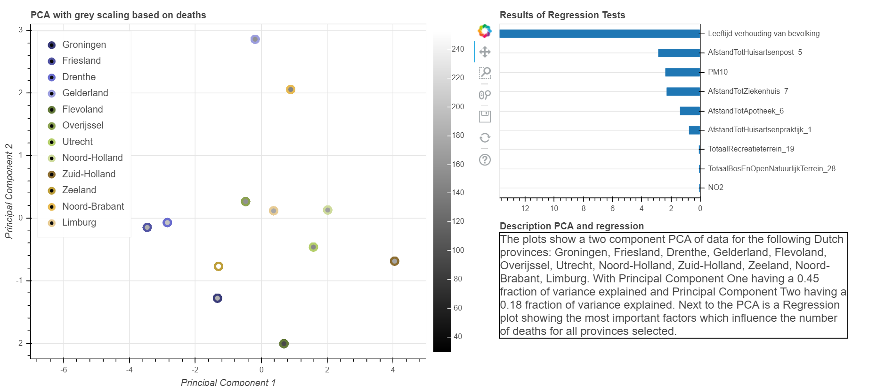

# Differences in Dutch provinces correlated with relative deaths
Iwan Hidding, Data Science for the Life Sciences, Hanze Hogeschool
 
 9th Februari 2020

## Introduction
There are differences in number of deaths per Dutch province. An extensive analysis was performed by the 
[CBS -article explaining the differences in deaths per region](https://www.cbs.nl/nl-nl/achtergrond/2013/07/regionale-verschillen-in-sterfte-verklaard) 2013. Where they
found multiple background factors which were able explain up to 70% of the relative deaths. Primarily social-economical 
variations, but cultural and lifestyle choices were also found to be relevant. They warn of the ecological fallacy, 
just because a province has an average lower life expectancy does not mean that living there will lead to a lower live 
expectancy for the individual. 

Their analysis focused on individuals 65 and older and looked at variables related to e.g. personal health and civil 
status. This new analysis takes the age ranges lower than 65 into account as well and primarily focuses on factors 
outside of personal control. For example the amount of nature and recreation space in each given province, as well as 
air pollution. This research could lead to different live expectancy when moving to a different province.      

## Methods
Multiple factors that were theorized to have an influence on the number of deaths per province. These factors consisted
of the distance to multiple health care providers, the age distribution, the amount of square footage of nature and 
recreation areas and air quality factors (PM10: atmospheric aerosol particles of a diameter smaller than 10 µm, and NO2: 
Nitrogen dioxide).

This data was collected primarily from the [CBS statline website](https://opendata.cbs.nl/statline/#/CBS/nl/). Then combined into a single dataframe. A PCA is
then performed on this data frame excluding the province names and the number of deaths.
This was plotted in a PCA plot using the circle lines to identify the province with the center of the circle using a 
grey-scale coloring based on deaths.

A regression test was then performed on this dataset, using the f regression function from the sklearn library.
This regression was plotted next to the Pca plot. 

A short description is added showing the provinces selected and the fraction of the variance explained by the PCA 
analysis.  

## Results

The image shows a PCA and a regression plot. With this data selection the regression plot shows a clear indication that 
given this data the age distribution is the most relevant factor to the number of deaths. The most relevant factor can 
change depending on the provinces selected, as some have more similar distributions of age and any of the other factors.

## Conclusion and Discussion
When comparing all provinces the biggest factor contributing to the number of deaths is the distribution of age per 
province. Interestingly the distance to the General practice center was the second factor, higher than the distance to 
the hospital. PM10 was also identified as an important factor. 

The dataset used in this analysis was likely not extended enough to categorically prove any correlation. Only the year 
2015 was used as for this year all data used was available. For a better analysis individual data sets per type of 
deaths could be used to identify different causes. Where certain causes of deaths will be more related to age, others 
like respiratory disease potentially caused by the PM10 would seem to have a smaller effect overall. 

Combining the results of a potentially improved dataset for this analysis with the analysis of the 2013
[CBS article](https://www.cbs.nl/nl-nl/achtergrond/2013/07/regionale-verschillen-in-sterfte-verklaard) could add to the percentage 
explained. Additionally while age is not a factor in this case 
